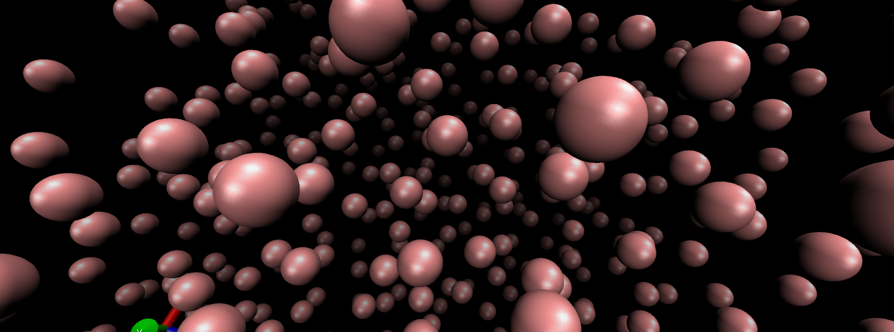
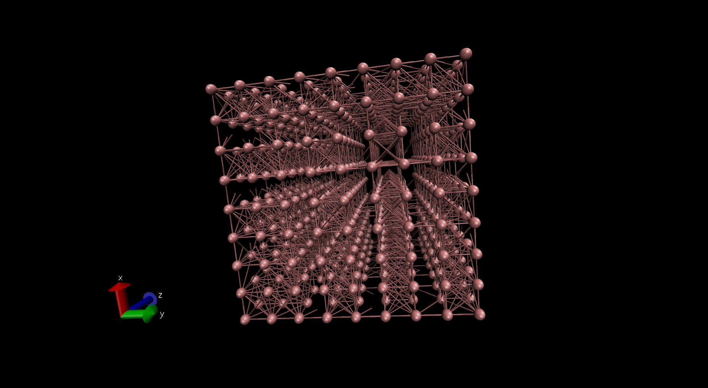
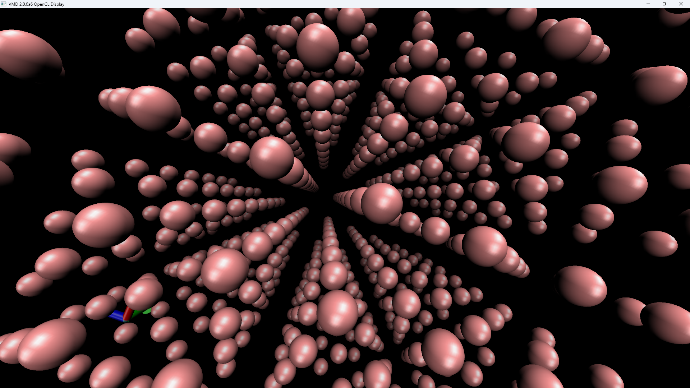
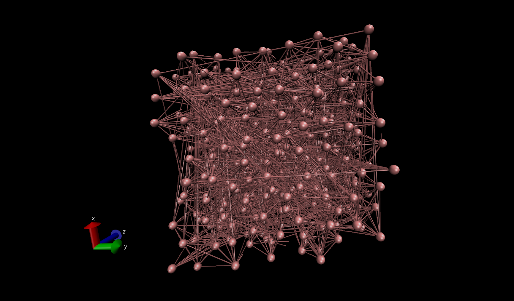
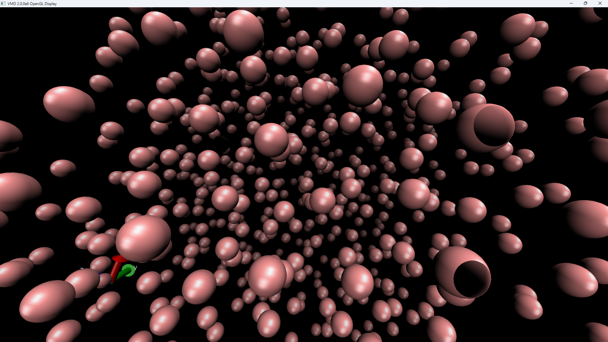
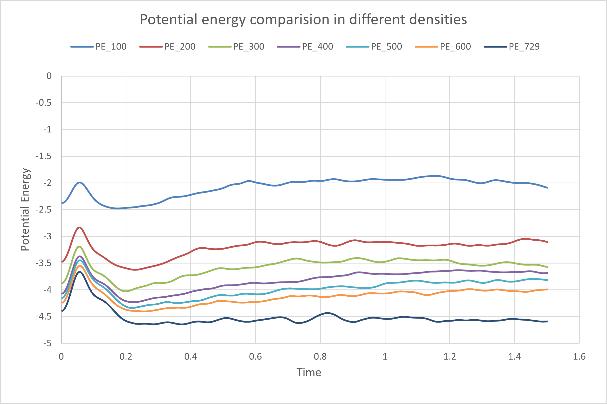
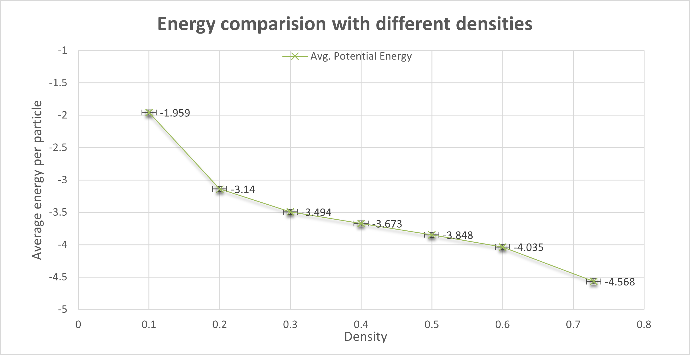
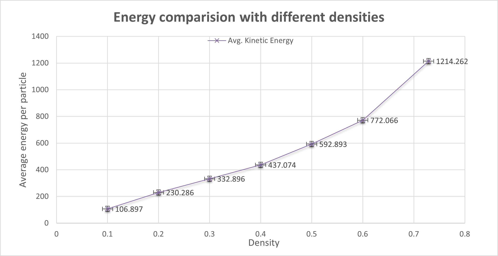
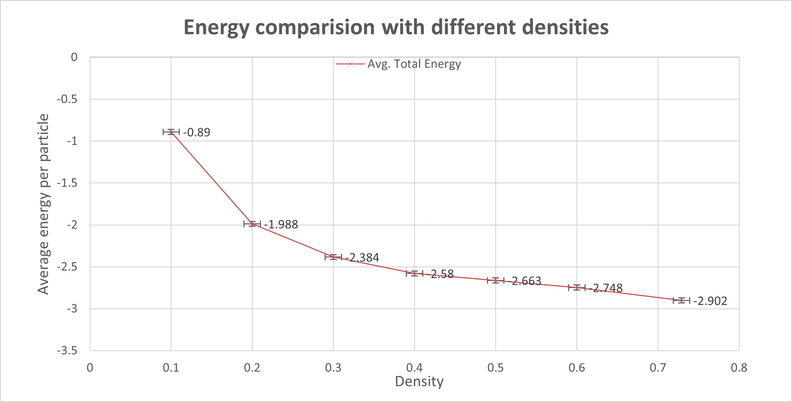

# Molecular Dynamics Simulation of Argon Gas  
Using the Lennard–Jones Potential (NVE Ensemble)

A classical molecular dynamics (MD) simulation of monoatomic argon gas using the Lennard–Jones (12–6) potential in reduced units. The system is evolved under periodic boundary conditions using the velocity–Verlet integration scheme in the microcanonical (NVE) ensemble to study energy conservation, density dependence, and dilute gas behavior.

## Author

Puspa Kamal Rai  
M.Sc. Physics  
Department of Physics  
Sri Sathya Sai Institute of Higher Education  
Website: https://puspa-opal.vercel.app/

## Purpose and Scope

This project demonstrates a clean and physically consistent molecular dynamics implementation for a dilute noble gas. It is intended for:
- Physics students learning molecular dynamics
- Computational physics coursework
- Validation of NVE energy conservation
- Visualization of gas-phase equilibration

## Key Features

- Classical MD simulation in reduced Lennard–Jones units  
- Velocity–Verlet integrator with excellent energy conservation  
- Periodic boundary conditions with minimum image convention  
- Density-dependent energy analysis  
- VMD-based trajectory visualization  

## Model Overview

### System Parameters

System: Monoatomic argon gas  
Number of particles: 729  
Simulation box: 10 × 10 × 10  
Volume: 1000  
Number density: ρ = 0.729  

The system lies firmly in the dilute gas regime.

### Reduced Units

σ = 1  
ε = 1  
m = 1  
k_B = 1  

## Interaction Potential

The Lennard–Jones potential is defined as

U(r) = 4 ( r⁻¹² − r⁻⁶ )

The corresponding interparticle force is

Fᵢⱼ = 48 r⁻² ( r⁻¹² − ½ r⁻⁶ ) rᵢⱼ

Cutoff radius: rc = 3.0  
The potential is shifted so that U(rc) = 0.

## Numerical Method

### Equations of Motion

m d²rᵢ / dt² = Fᵢ

### Integration Scheme

Velocity–Verlet algorithm

rᵢ(t + Δt) = rᵢ(t) + vᵢ(t) Δt + ½ aᵢ(t) Δt²  
vᵢ(t + Δt) = vᵢ(t) + ½ [ aᵢ(t) + aᵢ(t + Δt) ] Δt  

Time step: Δt = 0.001

## Thermodynamic Quantities

Total energy  
E = K + U  

Kinetic energy  
K = ½ Σ ( vxi² + vyi² + vzi² )

Temperature (equipartition)  
T = 1 / [ 3 ( N − 1 ) ] Σ ( vxi² + vyi² + vzi² )

Temperature emerges dynamically since the simulation is performed in the NVE ensemble.

## Visualization (VMD)

Initial configuration (simple cubic lattice):

  

Final configuration (equilibrated dilute gas):

  

The loss of lattice order and homogeneous particle distribution confirm equilibration to a gas phase.

## Energy Analysis

### Potential Energy Evolution at Different Densities

The initial transient reflects relaxation from the ordered lattice. After equilibration, the potential energy fluctuates around a stable mean value.

### Energy Components vs Density

Potential energy:

Kinetic energy:

Total energy:

Increasing density strengthens intermolecular interactions, making the potential energy more negative and increasing kinetic energy due to enhanced collisions. The total energy remains conserved.

## Energy Conservation
- Total energy fluctuations are of order 10⁻⁶  
- No long-term energy drift observed  
- Larger kinetic and potential energy fluctuations are physical, not numerical  

This confirms correct force evaluation, timestep choice, and NVE ensemble implementation.

## Results Summary
- Stable and conservative NVE dynamics  
- Physically consistent density dependence  
- Clear gas-phase behavior with no clustering  
- Robust numerical stability  

## Conclusion
This project provides a reliable molecular dynamics framework for simulating a monoatomic Lennard–Jones gas. The results align with classical kinetic theory and validate the velocity–Verlet integrator under periodic boundary conditions. The setup is well suited for extensions to higher densities, different ensembles, or transport property calculations.

## License
This project is intended for academic and educational use.

If you find this project useful, consider starring the repository or using it as a starting point for your own MD simulations.
